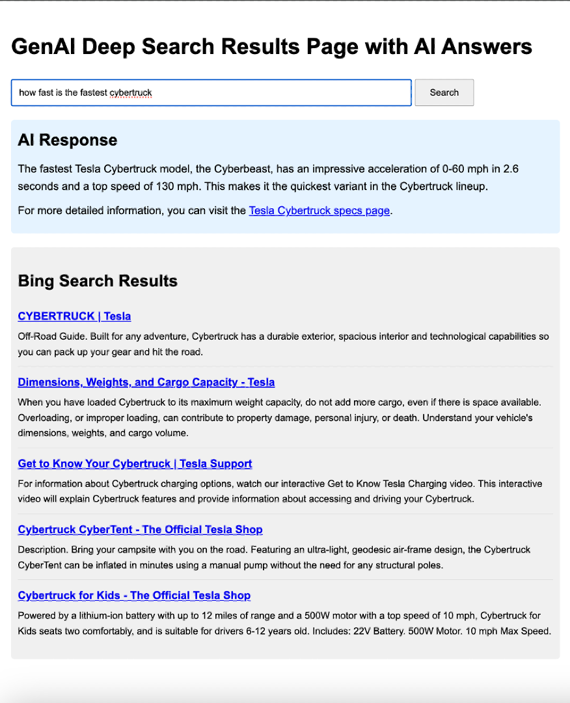

# GenAI Deep Search Results Page with AI Answers for your Own Site (Low Code)
This Low Code project leverages out of box Search capabilities and Open AI capabilities to enable a rich search experience for your website based solely on the public site information from your pages. The project uses Bing Custom Search to fetch relevant web pages based on a user's search query, leverages OpenAI's language models to pick up to a few of the pages that best answer the user's query, visits the pages to fetch and parse the text info on them, and then uses Open AI to generate comprehensive responses based on the page information.




## Project Structure

```
project_root/
├── backend/
│   ├── app.py
│   ├── requirements.txt
│   └── sysprompt.txt
├── frontend/
│   ├── index.html
│   └── search_results.js
├── setup.sh
├── start.sh
├── stop.sh
├── .env.template
├── .gitignore
└── README.md
```

## Prerequisites

Before setting up the project, ensure you have the following installed:
- Python 3.7 or higher
- pip (Python package manager)
- Node.js and npm
- Git

You'll also need to obtain the following:
- OpenAI API key
- Bing Web API Subscription key
- Bing Custom Search Configuration ID

## Quick Setup

For a quick, automated setup of both the backend and frontend, use our setup script:

1. Clone this repository and navigate to the project directory:
   ```
   git clone https://github.com/function1st/genaideepserp-public.git
   cd genaideepserp-public
   ```

2. Make the setup script executable:
   ```
   chmod +x setup.sh
   ```

3. Run the setup script:
   ```
   ./setup.sh
   ```

4. Follow the prompts to enter your:
   - OpenAI API key
   - Bing Web API Subscription key
   - Bing Custom Search Configuration ID
   - Brand name or domain name you want to use for prompting the AI assistant

Note: You'll need to set up a Bing Custom Search and obtain its Configuration ID before running this script. Visit the [Bing Custom Search Portal](https://www.customsearch.ai/) to create your custom search instance.

## Starting the Application

After you've run the initial setup, you can use the `start.sh` script to easily start both the backend and frontend servers:

1. Make the start script executable (if you haven't already):
   ```
   chmod +x start.sh
   ```

2. Run the start script:
   ```
   ./start.sh
   ```

3. The script will start both the backend and frontend servers.

4. Access the application by opening a web browser and navigating to:
   ```
   http://localhost:8080
   ```

5. The backend API will be available at:
   ```
   http://localhost:5001
   ```

6. When you're done, press Enter in the terminal where you ran the start script to stop both servers.

This script is useful for restarting the application after you've stopped it or if you've restarted your computer. It ensures that both the backend and frontend are properly started and connected.

## Stopping the Application

If you need to stop the application at any time, you can use the `stop.sh` script:

1. Make the stop script executable:
   ```
   chmod +x stop.sh
   ```

2. Run the stop script:
   ```
   ./stop.sh
   ```

This will safely terminate both the backend and frontend servers.

## Manual Setup

If you prefer to set up the project manually:

1. Set up the backend:
   ```
   cd backend
   python3 -m venv venv
   source venv/bin/activate
   pip install -r requirements.txt
   ```

2. Create a `.env` file in the `backend` directory based on `.env.template` and fill in your API keys.

3. Set up the frontend:
   ```
   cd ../frontend
   npm install -g http-server
   ```

4. Start the backend:
   ```
   cd ../backend
   python app.py
   ```

5. In a new terminal, start the frontend:
   ```
   cd frontend
   http-server -p 8080
   ```

## Usage

1. Open a web browser and go to `http://localhost:8080`.
2. Enter your search query in the provided input field.
3. Click the "Search" button or press Enter.
4. The application will display Bing Custom search results right away and then an AI-generated response will stream based on the context of the pages that were parsed.

## Development

- The main backend logic is in `backend/app.py`.
- Frontend code is split between `frontend/index.html` and `frontend/search_results.js`.
- The AI system prompt is stored in `backend/sysprompt.txt`. Modify this file to change the behavior of the AI assistant.
- Environment variables are managed through the `.env` file. Use `.env.template` as a guide to set up your own `.env` file.

**IMPORTANT:** This project is intended for educational purposes only and should not be used for production workloads. The creators and contributors of this project accept no responsibility for its functionality, reliability, or any consequences arising from its use.

**Disclaimer**
Users of this project are solely responsible for ensuring their use complies with the terms and conditions of all third-party services utilized, including but not limited to Bing Custom Search, Azure services, and OpenAI. Users must also ensure their use of this project adheres to all applicable local, national, and international laws and regulations.

The creators and contributors of this project are not responsible for any misuse, data breaches, costs incurred, or any other liabilities arising from the use of this project or the third-party services it integrates with. This project is provided "as is" without any warranty, express or implied, including but not limited to the warranties of merchantability, fitness for a particular purpose, and noninfringement. In no event shall the authors or copyright holders be liable for any claim, damages, or other liability, whether in an action of contract, tort, or otherwise, arising from, out of, or in connection with the software or the use or other dealings in the software.

## License
This project is licensed under the Creative Commons Attribution-NonCommercial 4.0 International License. To view a copy of this license, visit [CC BY-NC 4.0](https://creativecommons.org/licenses/by-nc/4.0/).

This project is licensed for free use for educational and non-commercial purposes only. Commercial use is strictly prohibited. The software is provided "as is", without warranty of any kind, express or implied. In no event shall the authors or copyright holders be liable for any claim, damages, or other liability, whether in an action of contract, tort, or otherwise, arising from, out of, or in connection with the software or the use or other dealings in the software.

## Contributing
Contributions to improve the educational value of this project are welcome. Please follow these steps to contribute:

1. Fork the repository
2. Create a new branch for your feature or bug fix
3. Make your changes and commit them with clear, descriptive messages
4. Push your changes to your fork
5. Submit a pull request with a clear description of your changes
